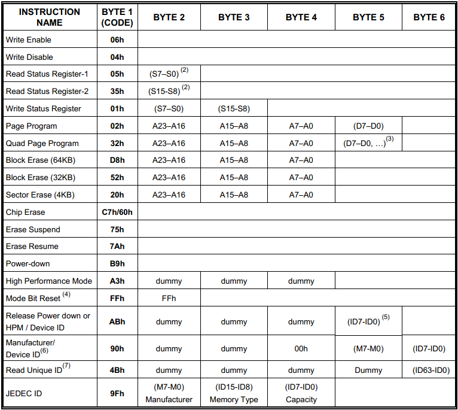

# Raspberry Pi SPI Interface 
-
## 2022/01/11 
* **WiringPi SPI**
    * Before you can use SPI interface, you may need to use the gpio utility to load the SPI drivers into the kernel
       
        *gpio load spi*  
       
    * allocate a 100KB buffer. (You should rarely need this though, the default is more than enough for most appl1ications).

        *gpio load spi 100* 

* **gpio load spi**
    * *#include <wiringPiSPI.h>*
    * *int wiringPiSPISetup (int channel, int speed);*
    * int wiringPiSPIDataRW (int channel, unsigned char *data, int len);
    * channel:  0 or 1
    * speed:  500,000 through 32,000,000 
  
## 2022/02/12
* Delay Function
  * *void delay (unsigned int howLong)*
    * delay ms
  * *void delayMicroseconds (unsigned int howLong)*
    * delay us
* Add W25Q32
   * Add W25Q32 API: W25Q32.cpp .h
   * Ads utility API: utility.cpp .h

## 2022/02/13
* W25Qxx Command Table
  

* W25Qxx操作注意
  
  1、頁為編程單位，可以一次性編程1個到256個字節；超過256個字節肯定要分多次寫入

  2、在編程之前，必須對對應的區域進行擦除操作，否則有可能寫入錯誤。

  3、擦除的最小單位是“扇區”，也可以以“塊”為單位進行擦除（此時塊可以為32K-bytes 或者64K-bytes），最大可以整塊擦除。

  4、讀操作比編程操作容易的多，沒有以上的細節考慮。可以一次性讀一個字節，也可以多個字節，甚至從頭讀到尾。

  Arduino 函數庫 github地址：https://github.com/Marzogh/SPIFlash